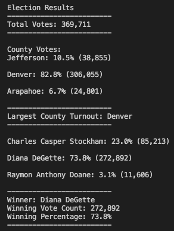

# Reporting Election Results/Module3

## Overview of Election Analysis

The aim of this project is to assisst a Colorado Board of Elections Committee member, Tom, in an election audit. The election audit involves the analysis of tabulated results for US Congressional precinct in Colorado. During the analysis of the election data we determine the total number of votes, voter turnout from each county and the percentage of votes from each county out of the total votes, percentage and number of of votes each candidate received and the winning candidate of the election. We perform the election analysis via Pyhton in an attempt to automate the process. This will allow to repeat and apply the process easily to other elections i.e. district, senatorial, or local elections.

## Election-Audit Results

* The total number of votes cast in this Congressional Election was 369,711.
* There were three counties in this election: Jefferson, Denver and Arapahoe. 
* The number of votes received by Jefferson was 38,855, it was 306,055 for Denver and was 24,801 for Arapahoe.
* The percentage of votes from Jefferson, Denver, and Arapahoe, out of the total votes were 10.5%, 82.8% and 6.7% respectively. 
* Out of the three counties, Denver received the largest number of votes: 306,055.
* The three candidates in this election were: Charles Casper Stockham, Diana Degette, and Raymon Anthony Doane.
* Charles Casper Stockham received 23.0% of the votes with 85,213 votes, Diana Degette received 73.8% of the votes with 272,892 votes and Raymon Anthony Doane received only 3.1% of the votes with 11,606 votes.
* Diane Degette is the winning candidate of the election having received 272,892 of the votes with a winning percentage of 73.8%. 

## Election-Audit Summary

* In this script, the lines of codes where we extract the candidate names and county names from each row can be modified. We know that we need to extract candidate name from the rows coincinding with column [1] and county name from the rows coinciding with column [2]. The mentioned codes are shown below:
    
        # Get the candidate name from each row.
        candidate_name = row[2]

        # 3: Extract the county name from each row.
        county_name = row[1]

* This script is based on the pre-knowledge that candidate name is in the column index 2 while the county name is in the column index 1. If these variables are located in different columns in other datasets this code will not work. Therefore, we can modify this hardocoded part of our script either by asking for user input for these variables or search the header for these variables using if statements. 

